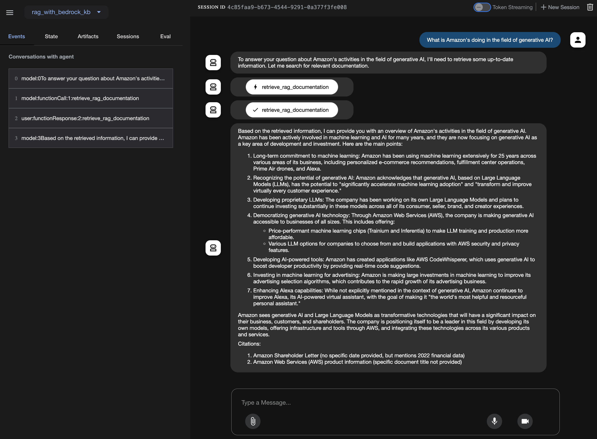

# QA Agent with LLM and RAG (Retrieval Augmented Generation) using Knowledge Bases for Amazon Bedrock

This project is an Question Answering Agent with Large Language Models (LLMs) and Knowledge Bases for Amazon Bedrock. An application using the RAG(Retrieval Augmented Generation) approach retrieves information most relevant to the user’s request from the enterprise knowledge base or content, bundles it as context along with the user’s request as a prompt, and then sends it to the LLM to get a GenAI response.

LLMs have limitations around the maximum word count for the input prompt, therefore choosing the right passages among thousands or millions of documents in the enterprise, has a direct impact on the LLM’s accuracy.

In this project, Knowledge Bases for Amazon Bedrock is used for knowledge base.

The overall architecture is like this:


### Overall Workflow

1. Deploy the cdk stacks (For more information, see [here](./kb_for_bedrock/README.md)).
   - A Knowledge Base for Amazon Bedrock to store embeddings.
   - A SageMaker Studio for RAG application and data ingestion to Knowledge Base for Amazon Bedrock.
2. Open JupyterLab in SageMaker Studio and then open a new terminal.
3. Run the following commands on the terminal to clone the code repository for this project:
   ```
   git clone --depth=1 https://github.com/ksmin23/adk-bedrock-samples.git
   cd adk-bedrock-samples
   git sparse-checkout init --cone
   git sparse-checkout set RAG/rag-with-bedrock-kb
   ```
4. Open `kb_for_amazon_bedrock.ipynb` notebook and Run it. (For more information, see [here](./data_ingestion_to_vectordb/kb_for_amazon_bedrock.ipynb))
5. Run your Agent.

   Using the terminal, navigate to the parent directory of your agent project:

   ```
   cd app
   ```

   Run the following command to launch the **dev UI**.

   ```
   adk web
   ```

   **Step 1**: Open the URL provided (usually `http://localhost:8000` or `http://0.0.0.0:8000`) directly in your browser.

   **Step 2**: In the top-left corner of the UI, you can select your agent in the dropdown. Select your agent (e.g., `rag_with_bedrock_kb`).

   **Step 3**: Now you can chat with your agent using the textbox:
   

### References

  * [Amazon Bedrock Workshop](https://catalog.us-east-1.prod.workshops.aws/workshops/a4bdb007-5600-4368-81c5-ff5b4154f518/en-US) - Hands-on labs using Amazon Bedrock APIs, SDKs, and open-source software, such as LangChain and FAISS, to implement the most common Generative AI usage patterns (e.g., summarizing text, answering questions, building chatbots, creating images, and generating code).
  * [Building with Amazon Bedrock and LangChain](https://catalog.workshops.aws/building-with-amazon-bedrock/en-US) - Hands-on labs using [LangChain](https://github.com/langchain-ai/langchain) to build generative AI prototypes with Amazon Bedrock.
  * [Amazon Bedrock Samples](https://github.com/aws-samples/amazon-bedrock-samples) - Pre-built examples to help customers get started with the Amazon Bedrock service.
