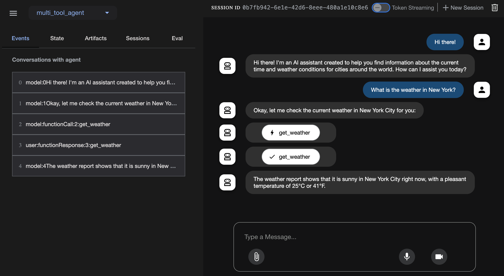

# Agent Development Kit (ADK) Samples

A collection of sample agents built with [Agent Development (ADK)](https://github.com/google/adk-python) and [Amazon Bedrock](https://aws.amazon.com/bedrock/)

## Quick Start
1. Set up Environment & Install ADK

   Create & Activate Virtual Environment (Recommended):
   ```
   # Create
   python3 -m venv .venv

   # Activate (each new terminal)
   # macOS/Linux: source .venv/bin/activate
   # Windows CMD: .venv\Scripts\activate.bat
   ```

   Install required packages:
   ```
   pip install -Ur requirements.txt
   ```

2. Run Your Agent

   Using the terminal, navigate to the parent directory of your agent project (e.g. using `cd multi-tool-agent`):

   ```
   parent_folder/      <-- navigate to this directory
       multi_tool_agent/
           __init__.py
           agent.py
           .env
   ```

   Run the following command to launch the **dev UI**.

   ```
   adk web
   ```

   **Step 1**: Open the URL provided (usually `http://localhost:8000` or `http://0.0.0.0:8000`) directly in your browser.

   **Step 2**: In the top-left corner of the UI, you can select your agent in the dropdown. Select your agent (e.g., `multi_tool_agent`).

   **Step 3**: Now you can chat with your agent using the textbox:
   

## References

 * [Agent Development Kit (ADK) Documentation](https://google.github.io/adk-docs/)
   * [Using Cloud & Proprietary Models via LiteLLM](https://google.github.io/adk-docs/agents/models/#using-cloud-proprietary-models-via-litellm)
   * [LiteLLM Supported Models & Providers > Amazon Bedrock](https://docs.litellm.ai/docs/providers/bedrock)
 * [Agent Development Kit (ADK) Samples](https://github.com/google/adk-samples/)
 * [LangChain Open Tutorial](https://github.com/LangChain-OpenTutorial/LangChain-OpenTutorial)
   * [LangChain Korean Tutorial(wikidocs)](https://wikidocs.net/book/14314)
   * [LangChain Korean Tutorial(github)](https://github.com/teddylee777/langchain-kr)
