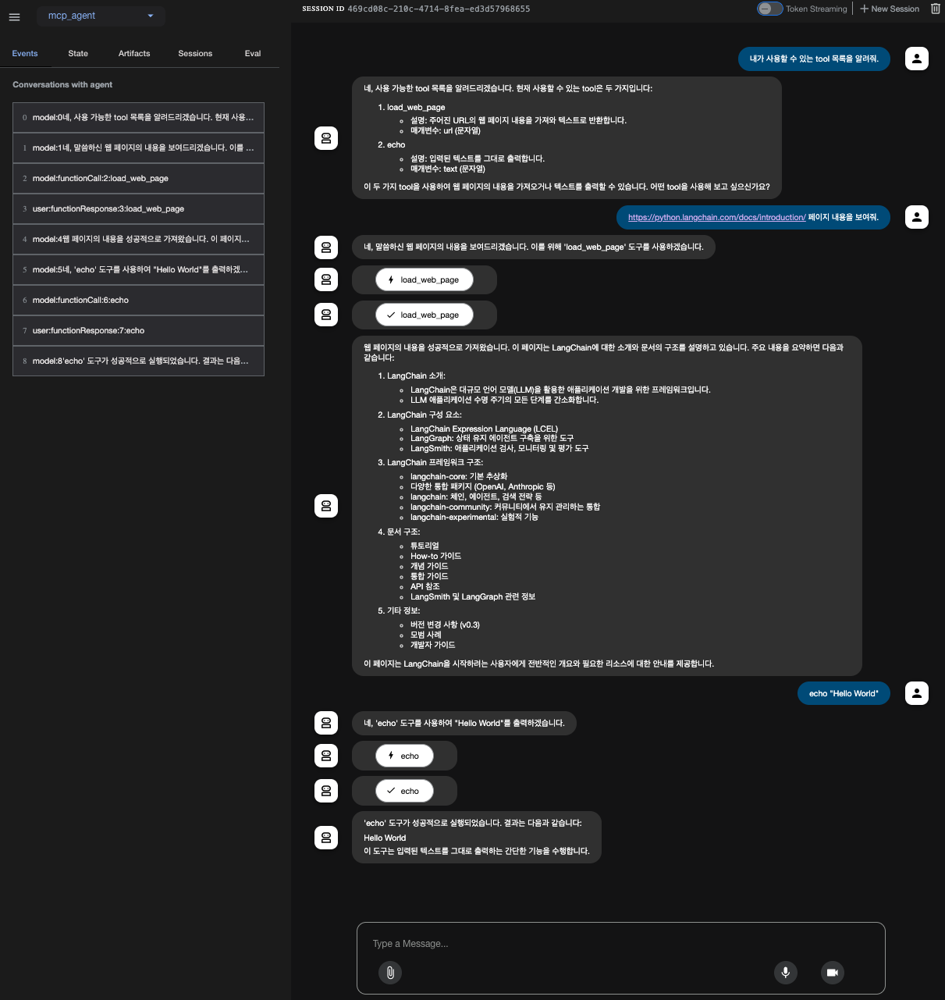

# Using MCP servers with ADK agents (ADK as an MCP client)

This example show hows to use more than two MCP servers with ADK agents (ADK as an MCP client).

In this example, we will use a `load_web_page` MCP server, which wraps ADK tools, and a  `simple_echo` MCP server, which is built with [fastmcp](https://gofastmcp.com/getting-started/welcome).

### Steps

1. Set up the model and mcp server
   ```
   BEDROCK_MODEL_ID=anthropic.claude-3-5-sonnet-20240620-v1:0
   MCP_SERVER_PATH=/absolute/path/to/mcp_server
   ```
   Replace `BEDROCK_MODEL_ID` and `MCP_SERVER_PATH` with your actual ones.
2. Run your Agent.

   Using the terminal, navigate to the parent directory of your agent project (e.g. using `cd mcp-agent`)::

   ```
    mcp-agent/      <-- navigate to this directory
       mcp_agent/
           __init__.py
           agent.py
           .env
       mcp_server/  <-- mcp server directory
           adk_tools_load_web_page.py
           simple_echo.py
   ```

   Run the following command to launch the **dev UI**.

   ```
   adk web
   ```

   **Step 1**: Open the URL provided (usually `http://localhost:8000` or `http://0.0.0.0:8000`) directly in your browser.

   **Step 2**: In the top-left corner of the UI, you can select your agent in the dropdown. Select your agent (e.g., `mcp_agent`).

   **Step 3**: Now you can chat with your agent using the textbox:
   

### References

  * [ADK MCP Tools](https://google.github.io/adk-docs/tools/mcp-tools/).
  * [ADK Quickstart](https://google.github.io/adk-docs/get-started/quickstart/)
  * [MCP/python-sdk/examples](https://github.com/modelcontextprotocol/python-sdk/tree/main/examples)
  * [FastMCP](https://gofastmcp.com/getting-started/welcome)
